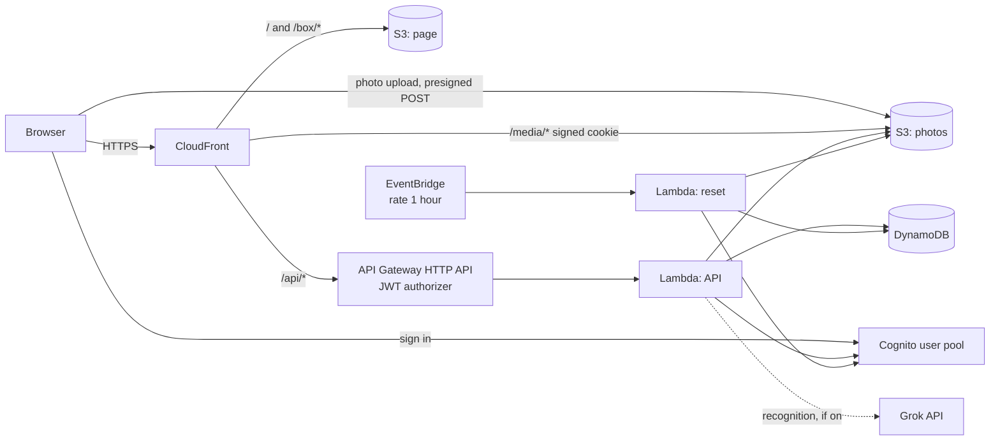

# inventory-serverless-aws

A home inventory of boxes, running serverless on AWS. Each box has a number, a description, a photo and a list of what is inside; search finds a box by any word from them. There is no server to patch and nothing runs while nobody uses it, so a small inventory costs a few cents a month.

Everything is stored in DynamoDB and S3 behind Cognito sign-in. Photos stay in a private bucket and reach the browser through CloudFront with a signed cookie.

## Demo

**https://dbpex5dl2nq28.cloudfront.net**

Sign in with `admin@example.com` / `admin123` (the fields are filled in for you).

The demo is public and wiped every hour: all boxes, photos, history and users go away, and the admin password is put back. Seven example boxes — four with photos — are written again after each wipe, so they are always there. Invitations do not send email in the demo; the temporary password is shown to the administrator instead. Photo recognition is off in the demo (see below).

## Features

- Boxes with a number (`12`, `A-7`), a description and contents in Markdown; a card per box at `/box/<number>` that can be shared, reloaded or opened in a new tab.
- Search across number, description and contents, every word has to match; `ё` counts as `е`, accented words stay whole.
- Photos: pick a file (on a phone the picker also offers the camera) or paste with ⌘V / Ctrl+V. The browser keeps a 2560 px JPEG for viewing and a 1280 px one for the list; a photo gallery view and a full-screen viewer.
- History of every change of the contents: before, after, who and an optional comment.
- Optional photo recognition: with a user's own Grok API key the photo is described into hidden text that search uses.
- Optional two-step sign-in with an authenticator app (TOTP), turned on, switched to another app or off in the settings by each user.
- Settings for administrators: invite, disable and delete users, see who has two-step sign-in and reset it for a lost phone.
- Interface in English, Russian, French and Italian, following the system language.

The page builds DOM nodes itself: text and Markdown never become HTML that runs.

## Architecture



| Part | Service |
| --- | --- |
| Page | S3 + CloudFront (default `*.cloudfront.net` domain and certificate); a CloudFront function serves `/box/*` from `index.html` |
| Sign-in | Cognito user pool, no self sign-up, optional TOTP |
| API | API Gateway HTTP API with a Cognito JWT authorizer, Lambda (Python, arm64) |
| Boxes, history, settings | DynamoDB on demand, one table |
| Photos | Private S3 bucket; uploads with a five-minute presigned POST, reads through CloudFront `/media/*` with a one-hour signed cookie |
| Demo reset | Lambda `reset.py`, EventBridge rule `rate(1 hour)` |

## What it costs

Nothing runs between requests, and most services fall within the AWS always-free allowances (Lambda 1M requests and 400,000 GB-s, CloudFront 1 TB and 10M requests, Cognito 10,000 monthly active users, DynamoDB 25 GB storage, CloudWatch Logs 5 GB). What remains is paid per request.

Estimate for **light use** — a handful of people, 200 boxes, 20,000 API calls, 2 GB of photos and 5 GB of traffic a month — at `eu-central-1` list prices:

| Service | Usage | Price | Per month |
| --- | --- | --- | --- |
| Lambda (API + 720 hourly resets) | ~21,000 invocations, 256 MB | free allowance | $0.00 |
| API Gateway HTTP API | 20,000 requests | ~$1.20 per million | $0.02 |
| DynamoDB on demand | 1,000 writes, 50,000 reads, < 1 GB | ~$0.76 / $0.15 per million, storage free | $0.01 |
| DynamoDB point-in-time recovery | < 0.1 GB | ~$0.24 per GB | < $0.01 |
| S3 (page + photos) | 2 GB, ~10,000 requests | ~$0.0245 per GB | $0.05 |
| CloudFront | 5 GB, 100,000 requests | free allowance | $0.00 |
| Cognito, TOTP included | < 10,000 active users | free allowance | $0.00 |
| CloudWatch Logs | < 1 GB | free allowance | $0.00 |
| **Total** | | | **≈ $0.10** |

Photo recognition is billed by xAI to the key's owner, per photo. A WAF web ACL is left out on purpose: it alone would cost about $5–6 a month.

Prices are approximate and change over time; check the AWS pricing pages for your region.

## Deploy

### What you need

1. An S3 bucket for Terraform state. The workflow uses the S3 backend with the native lockfile (Terraform 1.10+), so no DynamoDB lock table is needed.
2. AWS credentials allowed to create the resources above. Every resource name starts with `inventory-serverless` (the `name` variable), which makes a least-privilege policy easy.
3. In the GitHub repository:
   - secrets `AWS_ACCESS_KEY_ID` and `AWS_SECRET_ACCESS_KEY`;
   - variable `TF_STATE_BUCKET` with the state bucket name;
   - environment `demo` for the apply job.

### GitHub Actions

`.github/workflows/terraform.yml`:

- every push and pull request, three jobs side by side: `terraform fmt` and `terraform validate`; Lambda tests; frontend tests (see [Tests](#tests));
- pull requests from this repository: `terraform plan`, summary in the run;
- push to `main` or a manual run: plan and apply once all three pass. The job stops if the plan would destroy or replace a bucket, the table or the user pool; such a change has to be applied by hand.

The site address is printed in the run summary and in `terraform output site_url`.

### From a workstation

```bash
terraform init \
  -backend-config="bucket=<state bucket>" \
  -backend-config="key=inventory-serverless-aws/terraform.tfstate" \
  -backend-config="region=eu-central-1"
terraform apply
```

### Demo or private inventory

The defaults set up the public demo. For a private inventory, change them in a `terraform.tfvars`:

| Variable | Demo | Private inventory |
| --- | --- | --- |
| `demo` | `true` — the sign-in screen shows and fills in the admin sign-in | `false` — nothing is shown |
| `admin_email`, `admin_password` | `admin@example.com`, `admin123` | your own |
| `reset_schedule` | `rate(1 hour)` | `""` — no reset and no example boxes |
| `invite_emails` | `false` | `true` — Cognito emails the invitation |
| `recognition` | `false` | `true` — each user may set a Grok API key |
| `password_min_length` | `8` | `12` or more |
| `photo_max_bytes` | 6 MB | up to what you are ready to store |

A custom domain needs an ACM certificate in `us-east-1` and an alias on the distribution; see the comment at `viewer_certificate` in `cloudfront.tf`.

### Photo recognition

With `recognition = true`, the settings get a Recognition tab where each user stores their own xAI Grok API key and model. After a photo is saved, the API calls itself asynchronously, sends the 1280 px copy to Grok and stores the description as hidden text: it is searchable but not shown on the card unless asked for. The description is written in the language of whoever uploaded the photo.

It is off in the public demo for a reason: everybody signs in as the same administrator, so a key saved there could be read by the next visitor. The example boxes carry hidden text of their own, so searching for `baubles` or `pliers` still shows what recognition does.

## Repository layout

| Path | What is there |
| --- | --- |
| `*.tf` | Terraform |
| `web/` | The page: `app.js` (interface), `i18n.js` (translations), `styles.css`, `index.html` |
| `lambda/lambda_app.py` | API, with tests in `lambda_app_test.py` |
| `lambda/reset.py` | Hourly demo reset, with tests in `reset_test.py` |
| `seed/` | Example boxes of the demo (`boxes.json`) and their photos, uploaded to `seed/photos/` in the photo bucket |
| `cloudfront/` | CloudFront functions: `routes.js` (card addresses), `media.js` (photo paths), `api_host.js` (site address for the photo cookie) |
| `tests/web/` | Frontend tests |
| `.github/workflows/` | CI and deployment |

## Tests

```bash
cd lambda && python -m unittest -v lambda_app_test reset_test
cd tests/web && npm ci && npm test
```

**Lambda** (`lambda/*_test.py`, Python `unittest`). The handlers run against in-memory stand-ins for DynamoDB, S3 and Cognito, with requests built the way API Gateway sends them:

- search: folding, tokens, hidden photo text, accented words;
- identity: only a verified email names the user, so nobody reads another user's settings;
- error messages in the page language, field names included;
- administration: only the `admins` group gets in, invite (with and without email), disable, delete, reset two-step sign-in, no locking yourself out;
- recognition switched off: no key handed out or saved, nothing queued;
- CloudFront cookie signing, checked byte for byte against `openssl`;
- the demo reset: wipes the table, every photo version and other users, brings the admin back with two-step sign-in off and writes the example boxes and their history again, keeping their photos; every example photo exists.

**Frontend** (`tests/web/`, `node --test`):

| File | What it checks |
| --- | --- |
| `i18n.test.js` | Every interface string has English, French and Italian text with the same `{placeholders}`, and no Russian text reaches the page without `t()`; the system language is picked unless one was chosen. |
| `ui.test.js` | The page in headless Chrome against an in-memory API filled with the example boxes: demo sign-in, the example photos and a card opened by its address, search by hidden photo text, creating a box, the code step at sign-in, two-step sign-in in the settings with a real QR code (its integrity hash checked), recognition settings shown only when on, invitations without email and 2FA reset in the users list, switching language. Chrome is found on the usual paths or taken from `CHROME_PATH`; without it these tests are skipped locally and fail in CI. |

## Limits

- Everyone signed in sees and edits every box; there are no per-box permissions.
- Search scans the table with a filter, which is fine for thousands of boxes, not for millions.
- The Cognito invitation email has one language for the whole pool (English).

## Example photos

All CC0, resized for the demo:

| File | Photo | Author |
| --- | --- | --- |
| `raspberry-pi.jpg` | [Raspberry Pi Single Board Computer in Shipping Box with Accessories](https://commons.wikimedia.org/w/index.php?curid=20047235) | GR8DAN, Wikimedia Commons |
| `hand-tools.jpg` | [Transparent plastic box with tools - 28 x 10 cm](https://commons.wikimedia.org/w/index.php?curid=62434635) | Fructibus, Wikimedia Commons |
| `ornaments.jpg` | [Christmas Ornaments](https://stocksnap.io/photo/christmas-ornaments-Y4LYRYS38Y) | Copper and Wild, StockSnap |
| `tool-cases.jpg` | [Systainer toolbox stack](https://commons.wikimedia.org/w/index.php?curid=71110709) | Paul Sladen, Wikimedia Commons |
